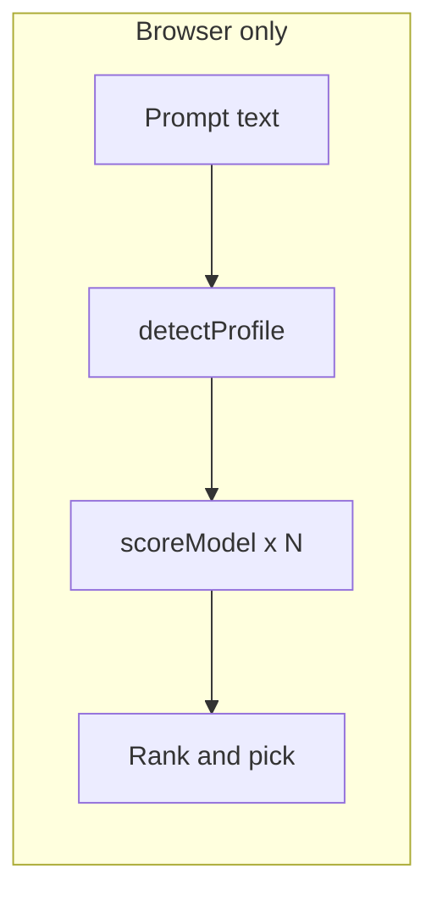

# Bullseye

This repository contains **Bullseye**, a **Vite + React** marketing site with an interactive **client-side LLM routing demo**.

---

## Table of contents

- [Purpose](#purpose)
- [Features](#features)
- [Tech stack](#tech-stack)
- [Quick start](#quick-start)
- [Project structure](#project-structure)
- [How routing works](#how-routing-works)
- [OpenRouter pricing sync](#openrouter-pricing-sync)
- [Analytics](#analytics)
- [Deploying to Vercel](#deploying-to-vercel)
- [Scripts reference](#scripts-reference)
- [Limitations and roadmap](#limitations-and-roadmap)

---

## Purpose

Since ChatGPT made LLMs mainstream, new models have shipped at a constant pace. The bottleneck is often no longer raw model capability, but the habit of using one familiar model for every task instead of choosing the right one for each job.

Bullseye is my interpretation of this problem: a routing demo that applies lightweight heuristics and model metadata (quality, latency, and cost signals) to recommend a best-fit model for a given prompt.

OpenRouter is currently one of the best-known products in this space, but its internal selection logic is not public. This project exists to explore those design choices in the open and to better understand what practical model selection looks like across a fast-moving LLM landscape.

Building Bullseye end-to-end also creates room to test product ideas quickly and add features aimed at AI-efficiency-focused users.

---

## Features

- **Privacy-first demo:** Routing runs entirely in the browser; no API calls send the user’s prompt.
- **Task inference:** Lightweight heuristics (regex + keyword cues) map prompts to profiles such as code, reasoning, creative, short/fast, or general.
- **Model scoring:** Each model is scored from quality (per profile), cost, latency, and footprint-style indices; the winner is deterministic.
- **Live USD signals:** When `openrouterPricing.json` is present, cost scoring and “savings vs fan-out” can use **real OpenRouter list prices** for a fixed reference token trip (prompt + completion).
- **Waitlist:** Opens the visitor’s mail client to the address set in `WAITLIST_EMAIL` (`WaitlistForm.tsx`).
- **Analytics:** Vercel Web Analytics plus an optional HTTPS webhook for custom events (no prompt body).

---

## Tech stack

| Layer | Choice |
|--------|--------|
| UI | React 19, TypeScript |
| Build | Vite 8 |
| Motion | Framer Motion |
| Analytics | `@vercel/analytics` |
| Pricing data | OpenRouter public models API → committed JSON |

**Requirements:** Node.js **18+** recommended (the pricing sync script uses native `fetch`).

---

## Quick start

```bash
git clone <your-repo-url>
cd Bullseye
npm install
npm run dev
```

Open the URL Vite prints (usually `http://localhost:5173`).

To refresh model list prices from OpenRouter (needs network):

```bash
npm run sync:pricing
```

Commit `src/data/openrouterPricing.json` when it changes so builds stay reproducible offline.

---

## Project structure

| Path | Role |
|------|------|
| `src/App.tsx` | Landing page: hero, value props, waitlist CTA, router section |
| `src/components/TryRouter.tsx` | Prompt input, “Route this prompt,” results UI, `route_demo` analytics |
| `src/components/WaitlistForm.tsx` | Waitlist: `mailto` to `WAITLIST_EMAIL` |
| `src/lib/router.ts` | Task detection + scoring + `routePrompt()` |
| `src/lib/modelRegistry.ts` | Model catalog: IDs, display names, quality/cost/latency/footprint indices |
| `src/lib/pricing.ts` | Reads `openrouterPricing.json`, computes reference trip USD |
| `src/lib/types.ts` | `TaskProfile`, `ModelSpec`, `RouteResult` |
| `src/lib/analytics.ts` | Vercel track + optional webhook (`sendBeacon` / `fetch`) |
| `scripts/sync-openrouter-pricing.mjs` | Fetches OpenRouter prices, writes JSON |
| `src/data/openrouterPricing.json` | Synced list prices (version-controlled) |

---

## How routing works

1. **Detect profile** — `detectProfile()` in `src/lib/router.ts` scores each `TaskProfile` from the prompt (code-like patterns, reasoning/creative wording, length, etc.) and returns a confidence value plus human-readable **signals**.
2. **Score models** — For each `ModelSpec`, a weighted sum combines:
   - **Quality** for that profile (0–1 per model, hand-tuned in the registry)
   - **Cost** — prefer lower USD for a reference trip when pricing JSON exists; otherwise a normalized cost index
   - **Latency** — lower latency index is better (extra weight when profile is `fast_cheap`)
   - **Energy / water** — normalized indices (see [Limitations](#limitations-and-roadmap))
3. **Rank** — Models are sorted by score; top pick and runner-ups are shown.
4. **Savings vs fan-out** — Compared to a fixed set of models (`NAIVE_FANOUT_IDS` in `modelRegistry.ts`): percentage deltas on cost/energy/water indices, and when USD data exists, **savings vs the sum of reference trips** for that fan-out set.



No inference APIs are called for routing; this is a **planning / education demo**, not a live gateway.

---

## OpenRouter pricing sync

`npm run sync:pricing` runs `scripts/sync-openrouter-pricing.mjs`, which:

1. `GET https://openrouter.ai/api/v1/models`
2. Maps each Bullseye registry ID to an OpenRouter model slug (see `SLUGS` in the script)
3. Writes `src/data/openrouterPricing.json` with:
   - `syncedAt` (ISO timestamp)
   - `referenceTokens` — default assumption **1000 prompt + 500 completion** tokens per “trip” (edit in the script output payload if you change the file manually)
   - Per-model `promptUsdPerToken` and `completionUsdPerToken`

If a slug is missing or lacks pricing, the script warns and omits that model from the JSON; `pricing.ts` then falls back to index-based cost for those IDs.

**Operational note:** Re-run periodically (e.g. weekly or before demos) so list prices stay plausible. Commit the JSON so CI and deploys do not depend on OpenRouter being up at build time.

---

## Analytics

- **Vercel Web Analytics:** Enable **Analytics** on the Vercel project for page views. Custom events use `@vercel/analytics`.
- **Custom event `route_demo`:** Fired when the user clicks **Route this prompt**. Payload includes `task_profile`, `model_id`, `prompt_len` (length only), `confidence`, and `has_usd_reference`. **Prompt content is never sent.**
- **Optional:** Set `VITE_ANALYTICS_WEBHOOK` to an **HTTPS** URL in Vercel (or `.env.local`) to get the same events mirrored to your own endpoint via `sendBeacon` / `fetch`.

---

## Deploying to Vercel

1. Push the repository to GitHub (or GitLab / Bitbucket).
2. Import the project in [Vercel](https://vercel.com/new) and select the **Vite** preset (or framework: Vite).
3. Under **Analytics**, enable **Web Analytics** if you want the built-in dashboard.
4. Deploy. Production builds use `npm run build` (`tsc -b` then `vite build`).

---

## Scripts reference

| Command | Description |
|---------|-------------|
| `npm run dev` | Start Vite dev server with HMR |
| `npm run build` | Typecheck and production build to `dist/` |
| `npm run preview` | Serve the production build locally |
| `npm run lint` | Run ESLint |
| `npm run sync:pricing` | Fetch OpenRouter prices → `src/data/openrouterPricing.json` |

---

## Limitations and roadmap

- **Task detection** currently uses heuristics (regex and keyword cues), not machine learning. A later iteration or production deployment could add a small classifier, embeddings, or explicit user-selected intent instead of inferring the profile only from the prompt text.
- **Quality, latency, energy, and water** are not measured model-to-model from provider APIs: major providers do not publish per-request environmental or footprint endpoints. The registry uses normalized indices for ranking and display. A future version may refresh those fields on a schedule (for example daily or frequent “seed” evaluations) using rough estimates tied to model size, inferred or documented hosting regions, and data center / hardware assumptions, with methodology documented alongside the numbers.
- **USD** in the demo comes from **OpenRouter list prices** and a fixed prompt/completion token assumption (`openrouterPricing.json`). It does not reflect negotiated pricing, volume discounts, or caching in a live integration.
- **Per-user satisfaction and tuning** are not implemented in this client-only build. A future version may add backend logic to record satisfaction (or similar signals) per prompt at aggregate level, subject to consent and retention policy, in order to refine routing heuristics over time.
